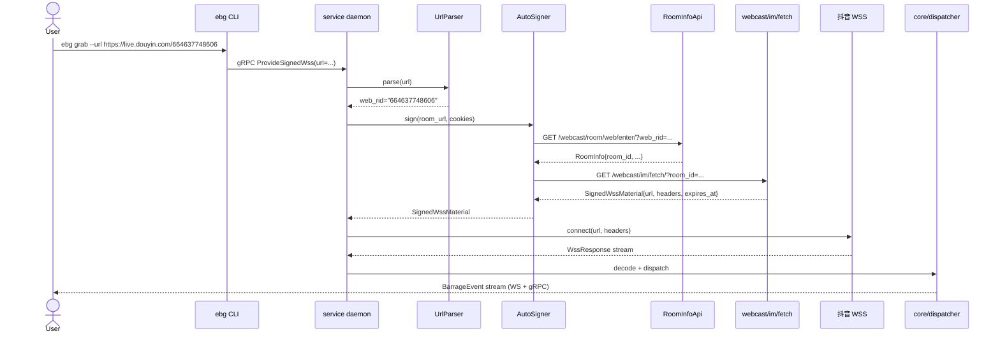
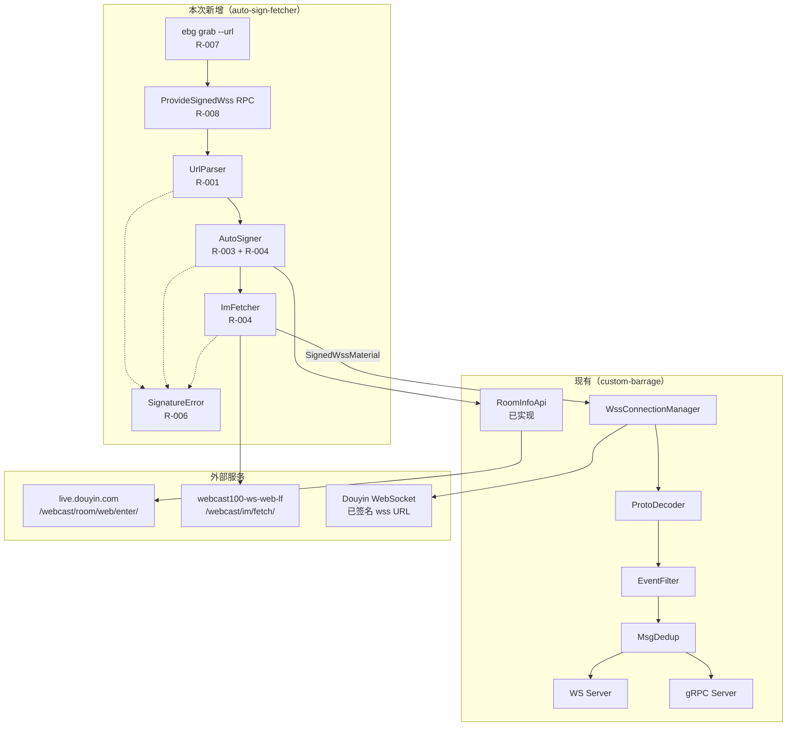
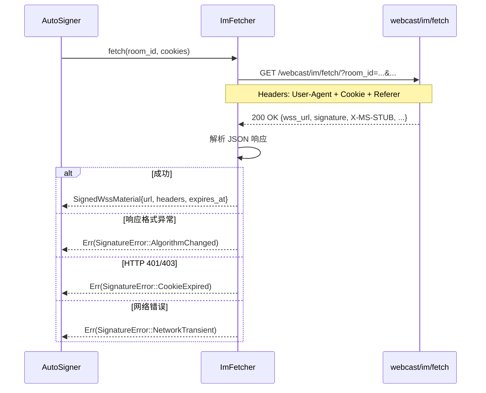

# Design — auto-sign-fetcher

> Phase 3 产出。技术架构、设计决策、数据流、风险缓解。

## 1. 架构总览

### 1.1 业务流程图（用户视角）



### 1.2 系统组件图（增量）



### 1.3 Crate 结构（增量）

```
crates/
├── collector/                   # 🔧 新增：AutoSigner + ImFetcher
│   └── src/
│       ├── lib.rs               # 已有 SignedWssMaterial + Collector trait
│       ├── url.rs               # 🆕 R-001: UrlParser
│       ├── signer.rs            # 🆕 R-003+R-004: AutoSigner
│       ├── im_fetch.rs          # 🆕 R-004: ImFetcher
│       └── error.rs             # 🆕 R-006: SignatureError
├── proto/                       # 🔧 扩展：新增 ProvideSignedWss RPC
│   └── proto/
│       ├── wss.proto            # 已有
│       ├── messages.proto       # 已有
│       └── signed.proto         # 🆕 R-008: ProvideSignedWssRequest/Response
├── service/                     # 🔧 扩展：实现 ProvideSignedWss
│   └── src/
│       ├── grpc_server.rs       # 🔧 R-008: 新增 ProvideSignedWss 实现
│       └── run.rs               # 🔧 集成 AutoSigner 到启动流程
└── cli/                         # 🔧 新增：ebg grab 子命令
    └── src/
        └── main.rs              # 🔧 R-007: clap 子命令
```

## 2. 数据流

### 2.1 完整数据流（URL → 弹幕）

```
1. User Input
   ↓
2. CLI: ebg grab --url <url>
   ↓
3. ebg 调用 gRPC ProvideSignedWss(url)
   ↓
4. service.grpc_server 接收请求
   ↓
5. UrlParser::parse(url) → web_rid
   ↓ (可能失败 → SignatureError::UrlFormatNotSupported)
6. AutoSigner::sign(web_rid, cookies) → SignedWssMaterial
   ├─ 6a. RoomInfoApi::get(web_rid) → room_id
   │  ↓ (可能失败 → RoomNotFound / CookieExpired / NetworkTransient)
   └─ 6b. ImFetcher::fetch(room_id, cookies) → wss URL + headers
      ↓ (可能失败 → AlgorithmChanged / CookieExpired / NetworkTransient)
7. WssConnectionManager::connect(material)
   ↓
8. WSS 流 → Decoder → Filter → Dedup → WS/gRPC 输出
```

### 2.2 关键时序（im_fetch 调用）



## 3. 模块设计

### 3.1 UrlParser（[R-001](requirements.md#r-001)）

**位置**：`crates/collector/src/url.rs`

**接口**：
```rust
/// 从用户输入 URL 提取 web_rid
///
/// 支持：
/// - `https://live.douyin.com/664637748606`
/// - `live.douyin.com/664637748606`（无 scheme）
/// - `live.douyin.com/xxx?foo=bar`（含 query）
/// - `live.douyin.com/xxx#section`（含 fragment）
///
/// 拒绝：
/// - `v.douyin.com/abc`（其他域名）
/// - `""`（空字符串）
pub fn parse(input: &str) -> Result<String, SignatureError>;

/// 解析后的 web_rid
pub type WebRid = String;
```

**实现要点**：
- 使用 `url::Url::parse` 容错处理（先尝试加 `https://` 前缀）
- 域名白名单：仅 `live.douyin.com`
- 路径首段 = web_rid
- query / fragment 忽略

**依赖**：
- `url` crate（workspace 已有）

### 3.2 SignatureError（[R-006](requirements.md#r-006)）

**位置**：`crates/collector/src/error.rs`

**接口**：
```rust
#[derive(Debug, thiserror::Error)]
pub enum SignatureError {
    #[error("URL format not supported: {url} (only live.douyin.com is accepted)")]
    UrlFormatNotSupported { url: String, retryable: false },

    #[error("URL is empty")]
    EmptyUrl { retryable: false },

    #[error("config missing: {field}")]
    ConfigMissing { field: String, retryable: false },

    #[error("cookie expired: please re-paste ttwid/sessionid in config.toml")]
    CookieExpired { retryable: false },

    #[error("algorithm changed: im_fetch response format is unknown")]
    AlgorithmChanged { retryable: false },

    #[error("room not found: {web_rid}")]
    RoomNotFound { web_rid: String, retryable: false },

    #[error("network transient error: {source}")]
    NetworkTransient {
        #[source]
        source: reqwest::Error,
        retryable: true,
    },
}

impl SignatureError {
    pub fn retryable(&self) -> bool {
        match self {
            Self::UrlFormatNotSupported { .. } => false,
            Self::EmptyUrl { .. } => false,
            Self::ConfigMissing { .. } => false,
            Self::CookieExpired { .. } => false,
            Self::AlgorithmChanged { .. } => false,
            Self::RoomNotFound { .. } => false,
            Self::NetworkTransient { .. } => true,
        }
    }
}
```

### 3.3 AutoSigner（[R-003](requirements.md#r-003) + [R-004](requirements.md#r-004)）

**位置**：`crates/collector/src/signer.rs`

**接口**：
```rust
/// 签名器：web_rid + cookies → SignedWssMaterial
pub struct AutoSigner {
    room_api: RoomInfoApi,
    im_fetcher: ImFetcher,
}

impl AutoSigner {
    pub fn new(config: &AppConfig) -> Result<Self> {
        // 从 config 构造 RoomInfoApi + ImFetcher
    }

    /// 主入口：完成所有签名调用
    pub async fn sign(&self, web_rid: &str) -> Result<SignedWssMaterial, SignatureError> {
        // 1. room_info: web_rid → room_id
        let room_id = self.room_api.get(web_rid).await
            .map_err(SignatureError::from_room_api_error)?;

        // 2. im_fetch: room_id + cookies → wss URL
        let material = self.im_fetcher.fetch(&room_id.room_id).await?;

        Ok(material)
    }
}
```

### 3.4 ImFetcher（[R-004](requirements.md#r-004)）

**位置**：`crates/collector/src/im_fetch.rs`

**接口**：
```rust
/// im_fetch 调用：webcast/im/fetch/ → SignedWssMaterial
pub struct ImFetcher {
    config: ImFetchConfig,
    client: reqwest::Client,
}

impl ImFetcher {
    pub fn new(config: ImFetchConfig) -> Result<Self>;

    /// 调用 im_fetch 拿到签名后的 wss URL
    pub async fn fetch(&self, room_id: &str) -> Result<SignedWssMaterial, SignatureError>;

    /// 内部：转换 reqwest::Error → SignatureError
    fn map_error(&self, e: reqwest::Error) -> SignatureError {
        if e.is_timeout() || e.is_connect() || e.is_request() {
            SignatureError::NetworkTransient { source: e }
        } else if e.status().map_or(false, |s| s.as_u16() == 401 || s.as_u16() == 403) {
            SignatureError::CookieExpired
        } else {
            SignatureError::AlgorithmChanged
        }
    }
}
```

### 3.5 Cookie 配置（[R-002](requirements.md#r-002)）

**位置**：`crates/service/src/config.rs`（扩展现有 `AppConfig`）

**新增结构**：
```rust
/// 鉴权配置（从 [auth] 段读取）
#[derive(Debug, Clone, Serialize, Deserialize, Default)]
pub struct AuthConfig {
    /// ttwid cookie（必需，至少一个）
    #[serde(default)]
    pub ttwid: String,

    /// sessionid cookie（可选）
    #[serde(default)]
    pub sessionid: String,
}

impl AuthConfig {
    /// 校验：至少一个 cookie 字段非空
    pub fn validate(&self) -> Result<(), SignatureError> {
        if self.ttwid.is_empty() && self.sessionid.is_empty() {
            return Err(SignatureError::ConfigMissing {
                field: "auth.ttwid or auth.sessionid".to_string(),
            });
        }
        Ok(())
    }

    /// 拼接 cookie header 值
    pub fn to_cookie_header(&self) -> String {
        let mut parts = Vec::new();
        if !self.ttwid.is_empty() {
            parts.push(format!("ttwid={}", self.ttwid));
        }
        if !self.sessionid.is_empty() {
            parts.push(format!("sessionid={}", self.sessionid));
        }
        parts.join("; ")
    }
}
```

**AppConfig 扩展**：
```rust
pub struct AppConfig {
    // ... 现有字段 ...

    #[serde(default)]
    pub auth: AuthConfig,  // 🆕 R-002
}
```

**`config.example.toml` 更新**：
```toml
# Auto-sign mode cookie（auto-sign-fetcher R-002）
[auth]
ttwid = "your_ttwid_here"
sessionid = ""  # 可选
```

## 4. gRPC 接口（[R-008](requirements.md#r-008)）

### 4.1 Proto 定义

**位置**：`crates/proto/proto/signed.proto`

```protobuf
syntax = "proto3";
package barrage.v1;

// R-008: 提供签名后 wss URL
// 向后兼容：不传 url 走 custom-barrage 路径；传 url 走 auto-sign 路径
service SignedBarrageService {
  // 用户提供 URL，服务自动完成签名
  rpc ProvideSignedWss(ProvideSignedWssRequest) returns (ProvideSignedWssResponse);
}

message ProvideSignedWssRequest {
  // 抖音直播间 URL（新增字段，向后兼容）
  // 不传 → 旧 custom-barrage 路径（用户提供 signed URL）
  // 传 → 新 auto-sign 路径
  optional string url = 1;

  // cookie 文件路径（可选，覆盖 config）
  optional string cookie_file = 2;
}

message ProvideSignedWssResponse {
  oneof result {
    SignedWssMaterial material = 1;
    SignatureErrorInfo error = 2;
  }
}

message SignedWssMaterial {
  string url = 1;
  map<string, string> headers = 2;
  int64 expires_at_unix = 3;
}

message SignatureErrorInfo {
  enum Code {
    UNKNOWN = 0;
    URL_FORMAT_NOT_SUPPORTED = 1;
    EMPTY_URL = 2;
    CONFIG_MISSING = 3;
    COOKIE_EXPIRED = 4;
    ALGORITHM_CHANGED = 5;
    ROOM_NOT_FOUND = 6;
    NETWORK_TRANSIENT = 7;
  }
  Code code = 1;
  bool retryable = 2;
  string message = 3;
}
```

### 4.2 向后兼容策略

| 客户端 | url 字段 | 行为 |
|--------|---------|------|
| 旧（不传 url） | 缺省 | 走 `custom-barrage` 路径，要求用户提供 signed URL（现状） |
| 新（传 url） | 有值 | 走 `auto-sign` 路径，本 feature 实现的链路 |

**重要**：`ProvideSignedWssRequest.url` 是 `optional string`（proto3 optional），旧客户端序列化时不包含此字段，新客户端可区分。

### 4.3 gRPC 服务实现

**位置**：`crates/service/src/grpc_server.rs`（扩展现有 `BarrageServiceImpl`）

```rust
#[tonic::async_trait]
impl SignedBarrageService for BarrageServiceImpl {
    async fn provide_signed_wss(
        &self,
        request: Request<ProvideSignedWssRequest>,
    ) -> Result<Response<ProvideSignedWssResponse>, Status> {
        let req = request.into_inner();
        if let Some(url) = req.url {
            // 新路径：auto-sign
            self.auto_sign_provider.serve(url).await
        } else {
            // 旧路径：custom-barrage（要求用户提供 signed URL）
            Err(Status::invalid_argument("url is required for auto-sign mode; use --wss-url for custom mode"))
        }
    }
}
```

## 5. CLI 接口（[R-007](requirements.md#r-007)）

**位置**：`crates/cli/src/main.rs`（扩展现有 clap 命令）

```rust
#[derive(Subcommand)]
enum EbgCommand {
    /// 启动服务（custom-barrage 模式）
    Start,

    /// 🆕 R-007: 自动签名并启动弹幕流
    Grab {
        /// 抖音直播间 URL
        #[arg(long)]
        url: String,

        /// cookie 文件路径（覆盖 config.toml）
        #[arg(long)]
        cookie_file: Option<PathBuf>,

        /// 详细日志
        #[arg(long, short)]
        verbose: bool,
    },
}
```

**错误输出格式**：
```bash
$ ebg grab --url live.douyin.com/xxx
Error: signature error
  code: URL_FORMAT_NOT_SUPPORTED
  retryable: false
  message: only live.douyin.com is accepted
exit code: 1
```

## 6. 设计决策

### 6.1 关键决策记录

| # | 决策 | 理由 | 替代方案 |
|---|------|------|---------|
| D1 | URL 解析用 `url` crate | workspace 已有依赖；标准库；容错好 | 正则（脆弱） |
| D2 | 错误用 `thiserror` + `enum` | 与现有 `core` crate 风格一致 | `anyhow`（丢失结构） |
| D3 | 签名调用放 `collector/` | 符合"签名是 collector 职责"的架构 | 新建 `signer/` crate |
| D4 | proto 扩展用新文件 `signed.proto` | 避免影响现有 `wss.proto` / `messages.proto` | 复用 `wss.proto`（耦合） |
| D5 | URL 字段为 `optional` | 严格向后兼容（区分旧/新客户端） | 默认值（无法区分） |
| D6 | im_fetch 用 reqwest | workspace 已有 `reqwest` 依赖 | 引入新 HTTP 库 |
| D7 | AutoSigner 拆为 RoomApi + ImFetcher | 单一职责；可独立 mock 测试 | 单体函数（难测试） |

### 6.2 关键设计权衡

**签名链路是热替换区域**：
- AutoSigner 是 `crates/collector/src/signer.rs`
- 签名逆向（X-MS-STUB / signature 算法）**不在本 feature 实现**
- 但代码结构必须**便于快速替换签名实现**（抖音可能任意时刻换算法）
- 建议：未来用 trait 抽象 `Signer`，便于注入 mock 或新算法

**为什么 URL 字段用 proto3 `optional` 而不是默认值**：
- proto3 默认值（空字符串）无法区分"客户端没传"和"客户端传了空"
- 用 `optional` 可以严格判断"用户是否提供了 URL"
- 这是 grpc 官方推荐做法

## 7. 风险缓解

| 风险 | 来源 | 缓解策略 |
|------|------|---------|
| 签名算法失效 | memory 标记 | `SignatureError::AlgorithmChanged` + Retryable=false + 日志 + 指标；签名代码独立模块便于替换 |
| Cookie 过期 | memory 标记 | `SignatureError::CookieExpired` + Retryable=false + 明确提示"请重新粘贴 ttwid" |
| 反检测 | memory 标记 | User-Agent 模拟 Chrome（沿用 `RoomApiConfig.user_agent` 默认值） |
| 现有测试破坏 | R-009 | URL 字段 `optional`；不改 dispatcher/filter/dedup；只新增模块 |
| 短链 302 重定向 | Phase 1 排除 | UrlParser 直接拒绝 `v.douyin.com`（不跟随重定向） |
| 网络抖动 | 新增 | `SignatureError::NetworkTransient` + Retryable=true，调用方按需重试 |

## 8. 实施路径

按依赖顺序：

```
T-001: SignatureError (R-006) ─────────────────┐
T-002: UrlParser (R-001) ─────────────────────┐│
T-003: AuthConfig (R-002) ────────────────────┼┤
T-004: ImFetcher (R-004) ─────────────────────┼┼──→ T-007: AutoSigner (R-003+R-004)
T-005: RoomInfoApi 错误映射 (R-003) ──────────┘┘
T-006: signed.proto + ProvideSignedWss (R-008) ──→ T-008: gRPC 服务实现 (R-008)
T-007: AutoSigner (R-003+R-004) ────────────────→ T-009: ebg grab CLI (R-007)
T-008: gRPC 服务实现 (R-008) ──────────────────→ T-010: WSS 集成 (R-005)
T-009: ebg grab CLI (R-007) ───────────────────→ T-011: 集成测试 (R-010)
```

---

*由 DevFlow 追踪。请勿手动编辑。*
