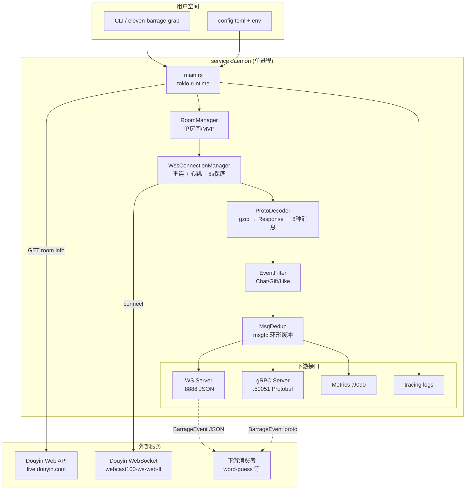
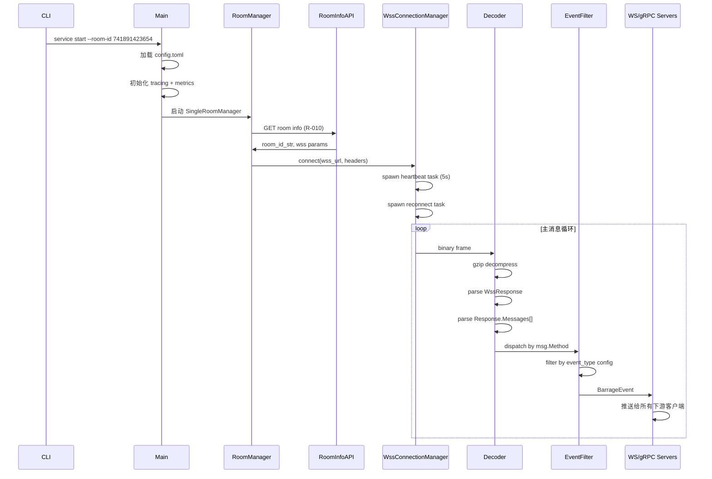
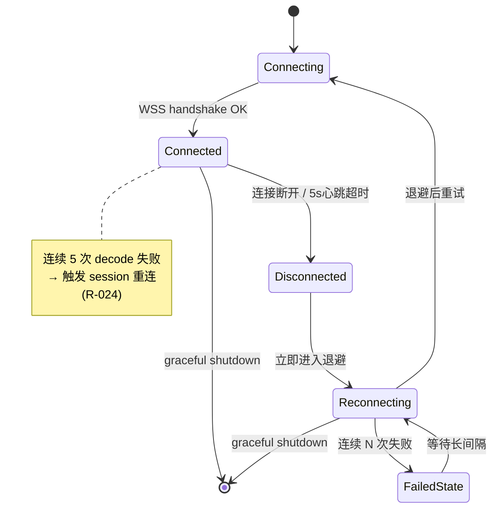

# Design — custom-barrage

> Phase 3 产出。技术架构、设计决策、数据流、风险缓解。

## 1. 架构总览

### 1.1 系统组件图



### 1.2 Crate 结构（workspace）

```
eleven-barrage-grab/
├── Cargo.toml                    # workspace root
├── Cargo.lock
├── crates/
│   ├── proto/                    # R-006: protobuf 类型
│   │   ├── Cargo.toml
│   │   ├── build.rs              # prost-build
│   │   └── proto/
│   │       ├── wss.proto         # 外层 WssResponse
│   │       └── messages.proto    # 内层 Response + 8 种消息
│   ├── core/                     # R-007/008/009/016/017/024: 解码核心
│   │   ├── Cargo.toml
│   │   └── src/
│   │       ├── decoder.rs        # gzip + WssResponse + Response
│   │       ├── dispatcher.rs     # Method → 8 种消息路由
│   │       ├── filter.rs         # MVP 事件过滤
│   │       ├── dedup.rs          # msgId 环形缓冲
│   │       ├── session.rs        # session 故障检测
│   │       └── resilience.rs     # R-005: ResiliencePipeline trait
│   ├── collector/                # R-011/012: 采集子命令（占位 MVP）
│   │   └── src/lib.rs
│   ├── service/                  # R-014/015/020/021/023/025: 主服务
│   │   └── src/
│   │       ├── main.rs
│   │       ├── room.rs           # RoomManager + SingleRoomManager
│   │       ├── wss.rs            # WssConnectionManager
│   │       ├── ws_server.rs      # WS JSON 输出
│   │       ├── grpc_server.rs    # gRPC Protobuf 输出
│   │       ├── api.rs            # R-010: 房间元数据 API 客户端
│   │       ├── mitm.rs           # R-013: MITM 兜底（占位 MVP）
│   │       └── watchdog.rs       # R-023: Watchdog
│   └── cli/                      # 命令行入口
│       └── src/main.rs
├── examples/
│   ├── python_client.py          # R-022: WS 客户端示例
│   └── grpc_client.py            # R-022: gRPC 客户端示例
├── docs/
│   ├── api-ws.md                 # R-032
│   └── api-grpc.md
└── devflow/custom-barrage/
```

## 2. 关键技术决策

### 2.1 异步运行时

| 维度 | 决策 | 理由 |
|------|------|------|
| 运行时 | **Tokio**（多线程） | 生态最成熟、`tokio-tungstenite`、`tonic`、`hyper`、`reqwest` 全部基于 Tokio |
| 单线程 vs 多线程 | **多线程** | 多房间并行场景需要，MVP 单房间也方便扩展 |
| 任务隔离 | **tokio::spawn** per room + **tokio::select!** 处理 shutdown | 标准模式 |

### 2.2 网络栈

| 组件 | 选型 | 版本约束 |
|------|------|---------|
| WebSocket 客户端 | `tokio-tungstenite` | 0.21+ |
| WebSocket 服务端 | `tokio-tungstenite` + `tungstenite`（accept） | 0.21+ |
| gRPC 框架 | `tonic` | 0.10+ |
| HTTP 客户端 | `reqwest`（含 rustls） | 0.12+ |
| TLS | `rustls` | 0.22+（避开 OpenSSL 依赖） |

### 2.3 协议层

| 组件 | 选型 |
|------|------|
| Protobuf 编译器 | `prost-build`（基于官方 protoc） |
| Protobuf 类型 | `prost::Message` 派生 |
| 序列化库 | prost 默认实现（零拷贝） |

### 2.4 错误处理

```rust
// crates/core/src/error.rs
use thiserror::Error;

#[derive(Error, Debug)]
pub enum DecodeError {
    #[error("invalid wire_type: {0} (must be 0-5)")]
    InvalidWireType(u8),

    #[error("gzip decompress failed: {0}")]
    GzipDecompress(String),

    #[error("unknown message method: {0}")]
    UnknownMethod(String),

    #[error("protobuf decode failed: {0}")]
    ProtobufDecode(#[from] prost::DecodeError),
}

// crates/service/src/error.rs
use anyhow::Result;

pub type ServiceResult<T> = Result<T>;
```

### 2.5 日志与 metrics

| 维度 | 选型 | 配置 |
|------|------|------|
| 日志 | `tracing` + `tracing-subscriber` | `RUST_LOG=info,eleven_barrage=debug` |
| 日志格式 | JSON（生产）/ pretty（开发） | `tracing-subscriber::fmt::layer().json()` |
| Metrics | `metrics` + `metrics-exporter-prometheus` | 默认 :9090 |
| 关键指标 | `barrage_events_total{event_type}`<br>`barrage_processing_duration_seconds`<br>`wss_connection_state{room_id}`<br>`decode_errors_total{error_type}`<br>`heartbeat_success_total` | Prometheus exposition format |

### 2.6 配置

```rust
// config.toml
[service]
room_id = "741891423654"            # 抖音直播间标识
ws_listen_addr = "0.0.0.0:8888"
grpc_listen_addr = "0.0.0.0:50051"
metrics_listen_addr = "0.0.0.0:9090"

[wss]
url = ""                            # 空 → 自动从 collector 获取
heartbeat_interval_secs = 5         # R-025
reconnect_initial_secs = 1          # R-015
reconnect_max_secs = 60

[events]
push_event_types = ["ChatMessage", "GiftMessage", "LikeMessage"]

[room_api]
cookie = ""                         # R-010: 可选
user_agent = "Mozilla/5.0 ..."

[mitm]
fallback_enabled = false            # R-013
```

### 2.7 接口契约

#### WS 消息格式（JSON）

```json
{
  "event_type": "ChatMessage",
  "timestamp_ms": 1719475200000,
  "data": {
    "user": { "id": "...", "nickname": "...", "avatar_url": "..." },
    "content": "主播好棒！",
    "room_id": "741891423654"
  }
}
```

#### gRPC Service 定义

```protobuf
syntax = "proto3";
package eleven_barrage.v1;

service BarrageService {
  rpc Subscribe(SubscribeRequest) returns (stream BarrageEvent);
}

message SubscribeRequest {
  string room_id = 1;
  repeated string event_types = 2;  // 空 = 全部订阅
}

message BarrageEvent {
  string event_type = 1;            // "ChatMessage" | "GiftMessage" | "LikeMessage" | ...
  int64 timestamp_ms = 2;
  oneof data {
    ChatMessage chat = 10;
    GiftMessage gift = 11;
    LikeMessage like = 12;
    MemberMessage member = 13;
    SocialMessage social = 14;
    ControlMessage control = 15;
    RoomUserSeqMessage stats = 16;
    FansclubMessage fansclub = 17;
  }
}
```

## 3. 数据流

### 3.1 启动序列



### 3.2 重连流程



## 4. 设计决策记录

### 4.1 决策：单二进制 daemon vs 多进程架构

**选项：**
- A. 单二进制（service + collector 合体） ✅ **采纳**
- B. 多进程（service + collector 分离）

**理由：**
- MVP 阶段 collector 本身是占位，未实现具体协议
- 单二进制部署更简单（一个 systemd unit）
- 多进程会增加 IPC 复杂度
- 后续可拆分为两个二进制而不破坏接口

### 4.2 决策：protobuf 生成 vs 手写类型

**选项：**
- A. `prost-build` 从 `.proto` 生成 ✅ **采纳**
- B. 手写结构体

**理由：**
- 原项目有完整的 `.proto` 定义（隐含在 `Modles/ProtoEntity/*.cs` 的 protobuf-net 特性中）
- 直接迁移 `.proto` 文件即可保留兼容性
- 字段命名 1:1 对应便于逆向调试

### 4.3 决策：JSON vs Protobuf vs MessagePack 作为 WS 编码

**选项：**
- A. JSON ✅ **采纳**（WS 通道）
- B. MessagePack
- C. Protobuf

**理由：**
- JSON 可读性最好（Python/JavaScript/Go 客户端零依赖接入）
- MessagePack 性能好但可读性差
- Protobuf 通过 gRPC 通道已覆盖（高效场景）
- WS 通道是"兼容路径"，JSON 是合理选择

### 4.4 决策：metrics 库选型

**选项：**
- A. `metrics` + `metrics-exporter-prometheus` ✅ **采纳**
- B. `prometheus`（直接）

**理由：**
- `metrics` 是抽象层，未来可换 exporter（OTLP / StatsD）
- 与 `tracing` 生态兼容

### 4.5 决策：MITM 兜底是否进 MVP

**选项：**
- A. 仅占位接口，实际不实现 ✅ **采纳（MVP 阶段）**
- B. 完整实现 MITM

**理由：**
- MITM 实现复杂度极高（CONNECT 解析、TLS 拦截、浏览器代理设置）
- 原项目 MITM 模式已稳定，新项目聚焦主动连接场景
- 留接口便于后续扩展

## 5. 风险与缓解

| 风险 | 等级 | 缓解措施 |
|------|------|---------|
| 抖音签名算法变化（X-MS-STUB） | 🔴 高 | ① MVP 阶段通过 collector 借用已签名的 URL<br>② 设计 `SignatureStrategy` trait 支持替换<br>③ 长期：监控开源社区方案（douyin-live-fetcher 等） |
| wss 连接不稳定 | 🟡 中 | ① 5s 心跳保底<br>② 指数退避重连（1s → 60s）<br>③ decoder 自愈（连续 5 次失败 → session 重连）<br>④ Watchdog 监控 |
| 内存泄漏（长跑 24h+） | 🟡 中 | ① msgId 环形缓冲（容量 300）<br>② 客户端断线自动清理<br>③ Phase 5 L3 真实房间长跑验证 |
| Windows + Linux 跨平台编译失败 | 🟢 低 | ① 避免 platform-specific 库<br>② 用 `rustls` 替代 `OpenSSL`<br>③ CI 在两平台编译 |
| protobuf schema 与原项目不一致 | 🟢 低 | ① 直接复用原项目 .proto 文件<br>② 字段命名 1:1<br>③ 单元测试用真实 dump 验证 |

## 6. 测试策略（三层验证）

| 层级 | 范围 | 工具 |
|------|------|------|
| **L1 烟雾** | 编译 + 启动 + 关键路径无 panic | `cargo test` + `cargo build` |
| **L2 交互** | 单元测试覆盖 protobuf 解码 + 路由 + 过滤 + 重连 | `tokio::test` + mock fixture |
| **L3 手工** | 真实抖音直播间端到端验证 | 人工操作浏览器 + 服务 |

L3 验收必须由用户操作真实房间完成（Phase 5）。

## 7. 与原项目对照

| 原项目（C#） | 新项目（Rust） |
|------------|--------------|
| .NET Framework 4.6.2 | Rust 1.74+ |
| Windows Forms UI | 无 UI（daemon） |
| Titanium.Web.Proxy | 直接 wss 连接（无 MITM MVP） |
| Fleck WebSocket | tokio-tungstenite |
| ProtoBuf-net | prost |
| Newtonsoft.Json | serde_json |
| NLog | tracing |
| Newtonsoft.Json.Linq | serde_json::Value |
| System.Timers.Timer | tokio::time::interval |
| Thread / BackgroundWorker | tokio::spawn |

## 8. 前置文档可指导性检查

按 DevFlow 要求，本节主动检查 R-xxx / design 是否足以指导实现：

- ✅ R-001 ~ R-033 均明确可转化为代码任务（每个都有验收标准）
- ✅ protobuf schema 复用原项目，避免歧义
- ✅ Crate 结构清晰、模块边界明确
- ✅ 接口契约（WS / gRPC）已定义
- ⚠️ 抖音签名机制（OQ-1）的具体技术方案需在 Phase 4 spike 验证（短期不影响 MVP 编码，因 MVP 阶段 collector 仅占位）
- ✅ MVP 范围明确，单房间 + Chat/Gift/Like 三种事件，足以分批编码

**结论：可以进入 Phase 4 实现。**