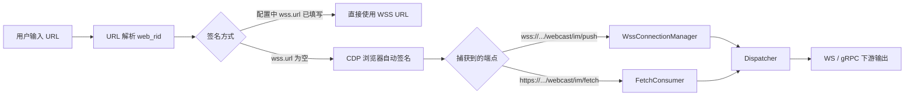
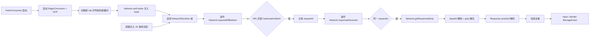

# Design Blueprint: url-fetch-consumer

## 业务流程



## CDP HTTP fetch 消费详细流程



## 范围边界

| 范围内 | 范围外 |
|---|---|
| `webcast/im/fetch` HTTP 响应体的 CDP 拦截与解码 | 自己实现 `a_bogus` / `signature` 签名算法 |
| `SignedMaterial` 类型扩展（WSS / HttpFetch） | 多直播间并发采集调度 |
| CLI `ebg grab --url` 支持 HTTP fetch 路径 | 持久化存储弹幕 |
| 保持浏览器轮询活跃的 JS 注入 | 绕过验证码/滑块 |
| 临时文件清理与 `.gitignore` 加固 | 浏览器路径自动搜索 |
| Linux 部署配置示例 | 容器/编排部署脚本 |

## 关键设计决策

### 1. `SignedMaterial` 枚举

在 `crates/collector/src/lib.rs` 引入：

```rust
#[derive(Debug, Clone, Serialize, Deserialize)]
#[serde(tag = "kind", rename_all = "snake_case")]
pub enum SignedMaterial {
    Wss(SignedWssMaterial),
    HttpFetch(SignedWssMaterial),
}
```

- 复用 `SignedWssMaterial` 的字段（url、headers、expires_at），避免重复。
- gRPC/REST 响应中增加 `kind` 字段，标明端点类型。
- CLI/Service 根据 `kind` 选择消费路径。

### 2. 自包含的 `FetchConsumer`

在 `crates/collector/src/fetch_consumer.rs` 实现：

- 独立启动一个浏览器进程并连接 CDP（不长期占用 `BrowserPool` 的 semaphore）。
- 导航到直播间后注入 `ttwid`/`sessionid`。
- 监听 `Network.requestWillBeSent` 与 `Network.responseReceived`。
- 对匹配 `/webcast/im/fetch` 的请求调用 `Network.getResponseBody`。
- 解码后通过 `mpsc::Sender<eleven_barrage_core::BarrageEvent>` 输出。

**为什么不用 `BrowserPool` 长期占用一个 tab？**
当前 `BrowserPool` 的 `sign()` 在签名后立即关闭 tab 并释放 semaphore，且健康检查需要写锁重启浏览器。长期占用会与现有签名调度冲突。自包含 `FetchConsumer` 让 fetch 路径与签名路径解耦，实现风险最小。

### 3. 解码路径

- WSS push：沿用 `WssDecoder::decode(frame, false)`，外层是 `WssResponse`，内层是 `Response`。
- HTTP fetch：body 是裸 `Response` protobuf，直接 `Response::decode(&body)`。
- 两种路径复用 `Dispatcher` 做消息到 `BarrageEvent` 的转换。

### 4. 去重

`FetchConsumer` 内部维护一个按 `method` 分组的 `msg_id` LRU（容量 300），与 `DouyinBarrageGrab` 的做法一致，避免轮询 overlap 导致重复消息。

### 5. 保持活跃

通过 `Runtime.evaluate` 周期执行：

```js
Object.defineProperty(document, 'visibilityState', { value: 'visible' });
window.dispatchEvent(new Event('focus'));
window.dispatchEvent(new Event('mousemove'));
```

必要时可进一步patch抖音轮询停止逻辑（参考 `DouyinBarrageGrab` 的 `forcePolling`），但MVP先采用轻量事件模拟。

## 组件职责

| 组件 | 文件 | 职责 |
|---|---|---|
| `SignedMaterial` | `crates/collector/src/lib.rs` | 统一签名结果类型 |
| `FetchConsumer` | `crates/collector/src/fetch_consumer.rs` | 启动浏览器、CDP拦截、解码、输出事件 |
| `FetchConnectionManager` | `crates/service/src/fetch.rs` | 在 service 中持有 `FetchConsumer` 并泵事件到下游 |
| `SingleRoomManager` | `crates/service/src/room/mod.rs` | 根据 `SignedMaterial` 类型选择 WSS/fetch 路径 |
| `ebg grab` | `crates/cli/src/main.rs` | 签名后按类型路由到 `connect_and_print` 或 `FetchConsumer` |
| `config.example.toml` | 仓库根目录 | Linux 部署配置模板 |

## 接口变更

### gRPC proto

`ProvideSignedWssResponse` 中的 `material` 增加 `kind` 字段：

```protobuf
enum MaterialKind {
  WSS = 0;
  HTTP_FETCH = 1;
}

message SignedWssMaterialProto {
  string url = 1;
  map<string, string> headers = 2;
  uint64 expires_at_unix = 3;
  MaterialKind kind = 4;
}
```

为保持兼容性，方法名可继续叫 `provide_signed_wss`，但返回内容可表示 fetch URL。

### REST /v1/sign

JSON 输出改为：

```json
{
  "kind": "http_fetch",
  "url": "https://live.douyin.com/webcast/im/fetch/?...",
  "headers": { ... },
  "captured_at_unix": 1234567890,
  "expires_at_unix": 1234571490
}
```

旧字段 `wss_url` 保留为 `url` 的别名（至少一个版本），CLI `ebg sign` 仍可解析。

### CLI

`ebg grab --url <url>` 流程：

1. 调用 gRPC `provide_signed_wss` 得到 `SignedMaterialProto`。
2. 若 `kind == WSS`，走现有 `connect_and_print`。
3. 若 `kind == HTTP_FETCH`，启动 `FetchConsumer` 并打印事件。

## 风险与缓解

| 风险 | 缓解 |
|---|---|
| CDP `Network.getResponseBody` 在响应到达前被调用会失败 | 仅在 `responseReceived` 中且 `requestId` 匹配后再调用 |
| 浏览器页面后台运行导致轮询暂停 | 周期注入 JS 模拟活跃；必要时升级到 patch 抖音轮询逻辑 |
| fetch body 为 gzip 压缩 | `WssDecoder` 已提供 gzip 解压，fetch 路径复用 |
| 单条 Response 过大 | `getResponseBody` 有大小限制时记录 warn，不崩溃 |
| 浏览器进程崩溃 | `FetchConsumer` 检测 CDP 连接断开，向上层返回错误；service 层可重试 |
| host 直接请求 Douyin 不可靠 | 所有消费逻辑在浏览器/CDP 内完成，host 不直接发请求 |

## 测试策略

- L1 单元测试：CDP 事件解析、`SignedMaterial` 分类、protobuf 解码。
- L2 集成测试：用 mock CDP transport 验证 `FetchConsumer` 事件流。
- L3 手工验收：用用户提供的直播间 URL + ttwid 跑一次端到端 `ebg grab`。
