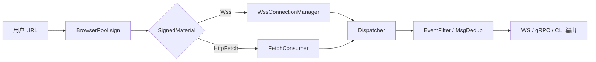

# Tasks: url-fetch-consumer

## 架构图

## 任务清单

| ID | 任务 | 依赖 | 涉及文件 | 状态 |
|---|---|---|---|---|
| T-001 | 定义 `SignedMaterial` 枚举（Wss/HttpFetch） | - | `crates/collector/src/lib.rs` | pending |
| T-002 | 更新 `signer.rs`/`pool.rs` 返回 `SignedMaterial`，并重命名捕获失败错误 | T-001 | `crates/collector/src/signer.rs`, `crates/collector/src/pool.rs`, `crates/collector/src/cdp/error.rs` | pending |
| T-003 | 实现自包含 `FetchConsumer`（CDP 拦截/解码/去重/活跃保持） | T-001, T-004（部分） | `crates/collector/src/fetch_consumer.rs`, `crates/collector/src/cdp/commands.rs`, `crates/collector/Cargo.toml` | pending |
| T-004 | 扩展 `WssDecoder` 支持裸 `Response` 解码；增加 `dispatch_response` | - | `crates/core/src/decoder.rs`, `crates/core/src/dispatcher.rs` | pending |
| T-005 | 服务层增加 `FetchConnectionManager`，`SingleRoomManager` 支持 fetch 路径 | T-003 | `crates/service/src/fetch.rs`, `crates/service/src/room.rs` | pending |
| T-006 | 更新 `signed.proto` 增加 `MaterialKind`；更新 gRPC 转换 | T-001 | `crates/service/proto/signed.proto`, `crates/service/src/grpc_signed.rs` | pending |
| T-007 | 更新 REST `/v1/sign` 响应格式与错误码 | T-001 | `crates/service/src/api/sign.rs` | pending |
| T-008 | 更新 CLI `ebg grab --url` 根据 `kind` 路由 | T-002, T-003, T-006 | `crates/cli/src/main.rs` | pending |
| T-009 | 清理临时文件、加固 `.gitignore`、创建 `config.example.toml` | - | `.gitignore`, `config.toml`, `config.example.toml` | pending |
| T-010 | 新增 L1/L2 测试：`SignedMaterial` 分类、`FetchConsumer` mock、decoder fetch body | T-001~T-004 | 各 crate `#[cfg(test)]` | pending |
| T-011 | workspace 全量回归：`cargo test --workspace` + `cargo clippy --workspace -- -D warnings` | T-001~T-010 | 整个 workspace | pending |

## 关键设计决策

1. **`SignedMaterial` 放在 `collector` crate**，服务/CLI 通过引入枚举统一处理两种签名结果。
2. **`FetchConsumer` 自包含**：不长期占用 `BrowserPool`，独立启动一个浏览器 + CDP 会话；结束后自动 kill 进程。
3. **解码复用 `WssDecoder`**：新增 `decode_fetch_body` 处理裸 `Response`（含 gzip 嗅探）。
4. **去重复用 `MsgDedup`**：`FetchConsumer` 内部实例化一个 `MsgDedup(300)`。
5. **活跃保持**：每 5s 通过 `Runtime.evaluate` 注入 JS，覆盖 `document.visibilityState` 并触发 focus/mousemove 事件。
6. **配置模板**：`config.example.toml` 给出 Windows/Linux 浏览器路径示例，所有 secret 字段为空。

## 提交计划

每个任务完成后，如果改动独立且编译通过，执行一次 commit（简短说明）。最终 T-011 通过后做一次汇总 commit。

## 阻塞与回退

- 若 `FetchConsumer` 在真实 CDP 中无法稳定拦截 response body，回退到 blueprint 重新评估轮询策略。
- 若编译出现无法解决的循环依赖，回退到 breakdown 重新划分 crate 边界。
